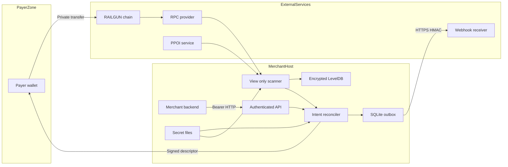

# PPOps threat model

Date: 2026-08-29
Version modeled: `0.1.0-beta.0`

## Executive summary

PPOps deliberately removes spending authority from the reconciler, so its
highest risks are confidentiality and payment-integrity failures rather than
direct fund withdrawal: theft of the viewing or merchant-signing keys, false or
withheld state from RPC/PPOI dependencies, compromise of the large pinned
RAILGUN dependency graph, and exposure or substitution of recovery bundles. The
Bearer API is acceptable only under the assumed single-merchant local/private
deployment; direct Internet exposure would materially raise authentication and
denial-of-service risk. Evidence anchors: `src/railgun/engine.ts`
(`RailgunViewOnlyEngine.start`), `src/runtime.ts` (`PPOpsRuntime.create`) and
`src/api/app.ts` (`createApiApp`).

## Scope and assumptions

In scope:

- Production runtime under `src/`, including the Hono API, CLI, configuration,
  SQLite repositories, EIP-712 descriptor, view-only RAILGUN engine/scanner,
  reconciliation, webhook delivery, runtime lock and recovery commands.
- Deployment controls in `Dockerfile` and `docker-compose.yml`.
- Build and dependency boundary in `package.json`, `package-lock.json` and
  `.github/workflows/ci.yml`.
- Tests and gate scripts only as evidence; they are not modeled as production
  entry points.
- The independently executed `tools/ppops-payer` harness at the shared
  repository, supply-chain and signed-request boundary only. Its payer host and
  spending wallet remain outside the merchant-runtime trust domain.

Out of scope:

- Correctness of RAILGUN contracts, circuits, cryptography, PPOI protocol and
  upstream nodes beyond how PPOps consumes them.
- A globally observing timing adversary, payer endpoint compromise, voluntary
  merchant disclosure, post-payment spending behavior and operating-system or
  hypervisor compromise.
- Payer mnemonic custody, public self-signer custody and operating-system state
  on the separate payer host.
- Hardhat and the files under `patches/`; they reproduce a controlled upstream
  gate and are not runtime dependencies.

Assumptions used because no correction was received after the context check-in:

- One merchant controls each instance; there is no tenant boundary inside PPOps.
- The API binds to loopback, or Docker publishes it only on host loopback. It is
  not directly exposed to the Internet.
- The merchant operator controls configuration and secret-file paths. RPC/PPOI
  services and blockchain inputs remain externally trustable only to the degree
  documented below.
- The merchant backend can protect the single administrative Bearer token and
  verify webhook replay windows/event IDs.
- Host filesystem access controls and disk/backup protection exist outside the
  application; PPOps SQLite is not application-level encrypted.

Open questions that would materially change risk ranking:

- Will any pilot put PPOps behind a public reverse proxy, share an instance
  between merchants, or accept requests from untrusted browser clients?
- Will the pilot use mainnet/value-bearing funds, and what payment volume and
  maximum tolerable confirmation delay apply?
- Are host disks and off-host backups encrypted and access-audited, and can the
  merchant signer be moved to a KMS/HSM after beta?

If the first answer is yes, TM-002 and TM-008 become high priority and this beta
profile must add proxy authentication/TLS, per-client authorization, rate limits
and abuse monitoring before exposure.

## System model

### Primary components

- **CLI and daemon:** parses a fixed command/option set, loads configuration and
  secrets, acquires a single-process lock, starts the engine and Hono server, and
  schedules scans. Evidence: `src/cli.ts` (`main`, `serve`, `init`) and
  `src/runtime.ts` (`PPOpsRuntime.create`).
- **Authenticated API:** creates and reads intents, exposes settlement/event
  state and verifies descriptors. It uses secure headers, a 64 KiB body limit,
  Zod schemas and constant-time Bearer-token digest comparison. Evidence:
  `src/api/app.ts` (`createApiApp`) and `src/security/auth.ts`
  (`bearerTokenMatches`).
- **Intent and descriptor engine:** creates random references/nonces, signs
  EIP-712 descriptors with an independent merchant identity key and verifies
  them against an expected signer plus instance policy. Evidence:
  `src/intents/service.ts` (`IntentService.create`, `verifyDescriptor`) and
  `src/security/descriptor.ts`.
- **View-only RAILGUN engine/scanner:** imports a shareable viewing key, rejects
  full-wallet/signing access, synchronizes TXOs and reduces strict encrypted
  memos to opaque references. Evidence: `src/railgun/engine.ts`
  (`RailgunViewOnlyEngine`) and `src/railgun/scanner.ts` (`RailgunScanner`).
- **Reconciler and stores:** persists commercial metadata/projections/outbox in
  SQLite and encrypted RAILGUN state in LevelDOWN. It credits only matched,
  finalized and PPOI-spendable settlements. Evidence: `src/db/database.ts`,
  `src/reconciliation/service.ts` and `src/reconciliation/projection.ts`.
- **Webhook worker:** sends persisted event JSON to one operator-configured URL
  over HTTPS with HMAC, timestamp and event ID, disabling redirects. Evidence:
  `src/events/webhook.ts` (`WebhookDeliveryService`).
- **Recovery tooling:** creates offline checksum-inventoried backups, optionally
  containing secret values, and restores only after profile/fingerprint checks.
  Evidence: `src/backup.ts` (`createBackup`, `restoreBackup`).

### Data flows and trust boundaries

- **Merchant backend → API:** commercial reference, atomic amount, expiry and
  Bearer credential cross local HTTP. All operational routes require one Bearer
  token; request bodies are limited and Zod-validated. PPOps has bounded
  in-memory per-source limits, but no application TLS, per-client roles or
  distributed rate limiter. Evidence: `src/api/app.ts` and
  `src/security/rate-limit.ts`.
- **API → intent engine → SQLite:** validated commercial metadata crosses an
  in-process boundary and is written through parameterized SQLite statements.
  File/directory modes restrict other local users, but commercial metadata is
  plaintext at the application layer. Evidence: `src/intents/service.ts` and
  `src/db/database.ts` (`insertIntent`).
- **Private files → runtime:** configuration, wallet state, viewing
  capability, API token, merchant signing key, RAILGUN DB key and optional
  webhook key cross the local filesystem boundary. They must be bounded regular
  files owned by the current user without group/other access on POSIX. PPOps
  rejects symlinks, opens with `O_NOFOLLOW` where available and rechecks the
  opened descriptor identity before parsing; secret values are validated and
  never API-returned. Evidence: `src/security/private-file.ts`,
  `src/security/secrets.ts` and `src/runtime.ts`.
- **PPOps → payer:** an EIP-712 descriptor and encrypted-memo reference leave
  the merchant host through the public checkout/request endpoint or a local
  request file. Authenticity depends on the payer obtaining the expected signer
  independently. The reference payer verifies every duplicated request field,
  serializes wallet access with a local runtime lock and reserves an intent in
  an owner-only write-ahead submission journal before broadcasting. Gate A
  records a precomputed signed transaction hash; Gate B records the bounded fee
  identity, payer, exact encrypted-submission quote fingerprint and nullifiers
  before Waku submission. After proof generation, a quote may rotate only when
  Broadcaster, token and fee rate remain identical. A Waku-returned hash remains
  untrusted metadata until the full payer wallet derives the canonical
  transaction hash from those nullifiers. Recovery precedes every explicit
  ambiguity retry; a retry must preserve the signed request, payer and complete
  nullifier set, exclude all previously attempted Broadcaster identities and
  remain within a three-retry cap. A different intent cannot reserve any
  unresolved nullifier. Evidence:
  `src/security/descriptor.ts`, `tools/ppops-payer/src/request.ts`,
  `tools/ppops-payer/src/security/runtime-lock.ts` and
  `tools/ppops-payer/src/security/submission-journal.ts`.
- **Payer → RAILGUN/blockchain:** the payer submits the private transfer. Public
  chain artifacts are outside PPOps control; the privacy gate demonstrates that
  the plaintext reference/memo is absent from the V2 commitment leaf. Evidence:
  `scripts/encrypted-memo-leaf-gate.ts`, `artifacts/privacy-report.json` and
  `tools/ppops-payer/src/railgun/broadcaster-transfer.ts`. Broadcaster mode also
  crosses operator-pinned fee-signer, DNS/Waku and selected-Broadcaster trust
  boundaries; it does not claim network-layer anonymity or relay availability.
  The controlled value-bearing trial reached two selected Broadcaster identities
  without obtaining a usable response or canonical transaction and therefore
  did not pass Gate B.
- **RAILGUN runtime ↔ RPC/PPOI:** encrypted chain history, receipts, block tags,
  PPOI statuses and timing cross outbound HTTPS/JSON-RPC and SDK-specific
  protocols. PPOps validates configured chain/deployment identity and fails
  payment credit closed unless finality and spendability agree. Receipt, block
  and finalized-height reads use a majority quorum across configured RPCs;
  PPOps still does not verify cryptographic RPC proofs and inherits PPOI trust.
  Evidence: `src/railgun/engine.ts`, `src/railgun/scanner.ts` and
  `src/railgun/rpc-quorum.ts`.
- **Reconciler → SQLite outbox → merchant webhook:** payment state crosses local
  SQLite and then outbound HTTPS. HMAC authenticates integrity/origin but does
  not hide payload from the webhook receiver; at-least-once delivery requires
  receiver-side timestamp and event-ID dedupe. Evidence:
  `src/events/webhook.ts` and `src/db/database.ts` (`outbox_events`).
- **Operator → CLI/config/backup:** trusted operator arguments and JSON select
  local paths, endpoints and recovery targets. Schemas, non-overlapping path
  checks, runtime locking, no-overwrite defaults, path inventory and move-aside
  restore reduce accidents; a malicious operator already controls the instance.
  Evidence: `src/config.ts`, `src/cli.ts`, `src/security/runtime-lock.ts` and
  `src/backup.ts`.
- **Developers/registry → build:** npm packages, GitHub Actions and the Docker
  base image cross the software-supply-chain boundary. Versions are locked and
  CI is read-only for verification; Actions and the base image are immutable
  pinned, high/critical advisories fail CI and a CycloneDX SBOM is retained. The
  pinned RAILGUN tree still carries moderate/low advisories and a large legacy
  surface. Evidence: `package-lock.json`, `.github/workflows/ci.yml`,
  `Dockerfile` and `docs/OPERATIONAL-PROFILE.md`.

#### Diagram

## Assets and security objectives

| Asset | Why it matters | Security objective (C/I/A) |
| --- | --- | --- |
| RAILGUN shareable viewing key | Reveals balances, history, counterpart-relevant memos and the receiver payment graph; cannot spend | C, I |
| Merchant EIP-712 signing key | Authorizes payer-facing descriptors; theft can redirect future payments | C, I |
| API token | Grants administrative read/create access to all local intent and settlement metadata | C, I |
| Webhook HMAC key | Authenticates confirmation events to the merchant backend | C, I |
| RAILGUN DB encryption key and LevelDB | Protect and persist the view-only wallet/scan state | C, I, A |
| Commercial references in SQLite | Link private settlements to invoices/customers and are the primary metadata PPOps promises not to publish | C, I, A |
| Settlement/projection/outbox state | Controls whether orders are considered paid and whether events are delivered once per transition | I, A |
| Expected merchant signer distribution | Root of trust that prevents checkout/descriptor substitution | I |
| RPC/PPOI responses | Drive finality and spendability decisions and expose request timing to providers | C, I, A |
| Recovery bundles | Can contain all privacy and service-identity secrets except a RAILGUN spending key | C, I, A |
| Build artifacts and lockfile | Compromise can execute code with access to every runtime secret | I |

## Attacker model

### Capabilities

- A remote blockchain participant can send arbitrary incoming RAILGUN notes and
  strict-looking random PPOps memo references to the merchant receiver.
- RPC/PPOI providers can observe source IP/timing, omit or delay data, return
  inconsistent responses or become unavailable.
- A network attacker can target a mistakenly exposed API or webhook path; under
  the assumed deployment, the operational API is not directly Internet-routable.
- A local unprivileged user, malware, stolen backup recipient or compromised
  dependency may attempt to read files or execute within the PPOps process.
- A supply-chain attacker can target npm dependencies, mutable CI actions,
  downloaded RAILGUN artifacts or container bases.

### Non-capabilities

- The ordinary remote attacker does not initially possess the API token,
  expected merchant signer, host filesystem access or operator-controlled
  configuration.
- PPOps never receives a RAILGUN mnemonic/spending key, so compromise of the
  intended process alone does not directly authorize spending.
- The model does not assume a break of EIP-712/ECDSA, RAILGUN encryption or hash
  primitives.
- The operator is trusted. An operator who deliberately changes keys, endpoints
  or binaries already controls the security outcome.

## Entry points and attack surfaces

| Surface | How reached | Trust boundary | Notes | Evidence (repo path / symbol) |
| --- | --- | --- | --- | --- |
| Health endpoints | `GET /v1/live`, `/v1/ready`, `/v1/health` | local network → daemon | Unauthenticated, metadata-minimal; readiness fails on failed/stale scans | `src/api/app.ts`; `src/api/server.ts` |
| Public checkout | `/pay/:id`, `/pay/:id/request.json` | payer → daemon | 128-bit unguessable intent ID, no commercial reference, CSP/no-store and rate limit | `src/api/app.ts` / `checkoutIntent` |
| Operational API | `/v1/intents`, `/runtime`, `/settlements`, `/events`, `/outbox`, `/metrics` | backend/client → daemon | Single Bearer role; 64 KiB body cap; socket-address rate limits | `src/api/app.ts`; `src/security/auth.ts`; `src/security/rate-limit.ts` |
| Descriptor parser/verifier | API or `descriptor-verify` CLI | payer/operator data → EIP-712 verifier | Strict Zod object and external expected signer | `src/security/descriptor.ts` |
| CLI option parser | Local process arguments | operator shell → privileged runtime | Fixed allowlist; rejects spending-key option | `src/cli.ts` / `parseOptions`, `assertAllowed` |
| Configuration JSON | `--config` file | local filesystem → runtime | Private-file identity/owner/size checks, Zod schema, loopback/HTTPS/path policy | `src/config.ts` / `loadConfig`; `src/security/private-file.ts` |
| Secret files | Configured paths | local filesystem → runtime memory | Private-file identity/owner/size checks and kind-specific formats | `src/security/secrets.ts` / `readSecret`; `src/security/private-file.ts` |
| Wallet-state JSON | Persistent state file | local filesystem → SDK wallet loader | Strict schema, private-file mode, fingerprint and address checks | `src/railgun/engine.ts` / `WalletStateSchema`, `loadOrCreateWallet` |
| RAILGUN TXOs/memos | SDK scan | chain/SDK → reconciler | Positive ERC-20 and strict memo parser; RPC normalization concurrency capped | `src/railgun/scanner.ts` / `scan`, `normalizeTXO` |
| RPC finality/receipt reads | Configured JSON-RPC URLs | external providers → scanner | Majority receipt/block/finality quorum, conservative height and divergence failure; no cryptographic proof | `src/railgun/rpc-quorum.ts`; `src/railgun/scanner.ts` |
| PPOI statuses | RAILGUN SDK callbacks/state | external PPOI → eligibility logic | HTTPS outside loopback; preflight health; explicit bucket mapping; unknown fails closed | `src/railgun/ppoi-preflight.ts`; `src/railgun/scanner.ts` / `bucketToPOIStatus` |
| Artifact-store paths/data | RAILGUN SDK | dependency/network-derived SDK state → filesystem | Root-containment check and private mode | `src/railgun/engine.ts` / `safeArtifactPath`, `artifactStore` |
| Webhook response/redirect | Outbound fetch | configured receiver → outbox worker | Remote HTTPS, redirect disabled, bounded timeout/retries | `src/events/webhook.ts` |
| Mainnet evidence CLI | live API, RPC quorum, receiver stats, snapshot files | operator/API/RPC/receiver → release evidence | HTTPS-or-loopback endpoints, strict schemas/profile, fresh receipt/block quorum checks, streamed-body/pagination caps, keyed redacted fingerprints, fail-closed phase comparison and merchant-signed final report | `src/pilot/mainnet-gate.ts`; `test/mainnet-gate.test.ts` |
| Backup manifest/files | `restore --input` | recovery media → local state/secrets | Strict inventory/path/digest/profile/fingerprint checks; checksums unauthenticated | `src/backup.ts` / `verifyBackup`, `restoreBackup` |
| npm/CI/container build | Install or CI run | registry/action/base image → executable | Lockfile, action/image pins, high/critical audit gate and SBOM; moderate/low advisories remain | `package-lock.json`; `.github/workflows/ci.yml`; `Dockerfile` |

## Top abuse paths

1. **Steal the payment graph:** compromise the merchant host or an unencrypted
   recovery bundle → read the shareable viewing key/LevelDB → decrypt historical
   receiver notes and correlate opaque references with local SQLite → disclose
   merchant payment history, even though spending remains impossible (TM-001,
   TM-006, TM-010).
2. **Redirect future payments:** obtain the merchant EIP-712 signing key → sign a
   valid-looking descriptor with an attacker receiver → exploit a payer that
   trusts only the recovered key and not an independently pinned merchant
   profile → receive future payments (TM-003).
3. **Abuse an accidentally public API:** discover a non-loopback deployment →
   steal/brute-force/recover the single Bearer token from another component →
   enumerate invoice-linked state or create fraudulent intents → cause metadata
   loss or payment confusion (TM-002).
4. **Manipulate settlement availability/integrity:** operate or compromise a
   majority of the selected RPC providers or the PPOI path → omit receipts,
   delay finality or feed misleading spendability state → keep legitimate
   orders unpaid or subvert an inherited trust boundary (TM-004, TM-009).
5. **Exploit the dependency boundary:** publish/compromise a transitively loaded
   RAILGUN/GraphQL/Web3 package or artifact path → obtain code execution in the
   daemon → read viewing/signing/API keys and alter SQLite events (TM-005).
6. **Substitute or corrupt a backup:** gain write access to recovery media →
   replace both files and the unauthenticated checksum manifest → restore stale
   or attacker-chosen state, or steal a bundle created with
   `--include-secrets` → cause privacy disclosure and operational takeover
   (TM-006).
7. **Replay merchant events:** capture a valid HMAC webhook request at or after
   the receiving backend → replay it to a receiver that ignores timestamp and
   event-ID dedupe → duplicate fulfillment even though PPOps outbox state is
   idempotent (TM-007).
8. **Exhaust reconciliation capacity:** send many decryptable notes with
   strict-looking unknown references or flood an exposed API with requests →
   force wallet decryption, RPC calls, SQLite growth or CPU/memory pressure →
   delay legitimate payment confirmation (TM-008).
9. **Trigger a semantic false state:** exploit a newly changed TXO/PPOI field,
   settlement-identity collision or projection regression not covered by the
   pinned gate → cross the paid threshold incorrectly or emit a misleading
   reversal/confirmation (TM-009).
10. **Exploit ambiguous relay state:** lose or forge a Broadcaster response after
    Waku submission → tempt the operator to create a fresh payment with inputs
    that may already be in flight → double-pay or permanently strand the local
    workflow. The payer instead reserves nullifiers before Waku, recovers first,
    permits only bounded conflicting same-nullifier variants through previously
    unattempted identities and then requires manual review (TM-003, TM-004,
    TM-009).

## Threat model table

| Threat ID | Threat source | Prerequisites | Threat action | Impact | Impacted assets | Existing controls (evidence) | Gaps | Recommended mitigations | Detection ideas | Likelihood | Impact severity | Priority |
| --- | --- | --- | --- | --- | --- | --- | --- | --- | --- | --- | --- | --- |
| TM-001 | Local malware, host intruder, malicious backup reader | Read access to the merchant host, process memory or recovery material | Exfiltrate the viewing key and correlate RAILGUN history with SQLite | Full receiver payment-graph disclosure; no direct spend | Viewing key, LevelDB, commercial metadata | Owner-only bounded regular files; symlink rejection, no-follow open and opened-file identity recheck; separate encrypted RAILGUN DB key; no API/log return; view-only signature/full-wallet rejection (`src/security/private-file.ts`, `src/security/secrets.ts`, `src/railgun/engine.ts`) | Process must hold the viewing key; no OS keyring/TEE; SQLite links remain plaintext | Require full-disk encryption, dedicated OS identity, restricted egress, secret-manager mounts and rotation/re-import procedure; consider isolating scanner in a least-privileged process | Alert on secret/config permission changes, unexpected outbound destinations, backup access and wallet fingerprint changes | Medium: host/backup compromise is realistic for self-hosted software, but requires local or supply-chain foothold | High: destroys the central privacy property for the receiver history | high |
| TM-002 | Remote/local network attacker or compromised merchant app | API is exposed or Bearer token is stolen | Enumerate state, create intents or exhaust API resources using the single administrator credential | Commercial metadata disclosure and payment-workflow manipulation | API token, intents, settlement/event data, availability | Loopback default and explicit `allowRemote`; constant-time Bearer comparison; body/header/time limits; in-process rate limits; Docker host-loopback publish (`src/config.ts`, `src/api/app.ts`, `docker-compose.yml`) | No built-in TLS, token scopes, dual-token rotation or per-client audit identity; in-memory limits are per process | Keep loopback; if proxied, require TLS/mTLS or strong proxy auth, IP policy, distributed rate limits and request audit IDs | Alert on 401/413/429 rates, new source addresses, intent-create spikes and non-loopback binds | Low under stated local-only assumption; medium/high if public | High because the token exposes all merchant operational metadata | medium, conditional high if public |
| TM-003 | Host intruder, checkout attacker with stolen signer | Merchant EIP-712 signing key is obtained, or payer learns expected signer through the compromised channel | Sign a descriptor for an attacker-controlled recipient/profile | Theft of future payer funds and merchant impersonation | Merchant signing key, expected-signer distribution, payer funds | Independent key from RAILGUN wallet; strict EIP-712 schema; recovered and embedded signer must match; instance profile/expiry checked (`src/security/descriptor.ts`, `src/intents/service.ts`) | Key is a plaintext file in process; trusted-signer distribution is outside repo; no rotation/key ID | Publish signer fingerprint over a separately authenticated channel; document rotation/revocation; move signer to KMS/HSM or offline signer before mainnet | Monitor unexpected signer/profile changes and descriptors not present in local intent DB | Medium: requires host/channel compromise, but signer is online for every intent | High: can redirect new payments even though existing RAILGUN funds remain safe | high |
| TM-004 | Malicious/failed RPC or PPOI operator; network observer | A majority of RPC sources or inherited PPOI path is compromised, or endpoints observe timing | Omit, delay or falsify receipt/finality/PPOI data and observe scan timing | Payment censorship/delay, privacy leakage and potentially unsafe state | Settlement integrity/availability, request-timing privacy | Exact chain/deployment check; Arbitrum `finalized` enforcement; majority RPC quorum; matched + `FINALIZED` + `SPENDABLE` gate; unknown PPOI fails closed; recent-finalized receipt recheck (`src/config.ts`, `src/railgun/rpc-quorum.ts`, `src/railgun/scanner.ts`) | No cryptographic RPC proofs; PPOI is inherited trust; providers can correlate timing and a quorum can fail availability | Use administratively independent or self-hosted privacy-preserving RPCs, production PPOI and egress policy; investigate every divergence | Metadata-free ready/scan metrics, provider divergence failures, PPOI bucket age and confirmation latency | Medium: outages/inconsistency are common and provider observation is inherent | High: can censor fulfillment; integrity requires majority/PPOI compromise | high |
| TM-005 | npm/action/base-image/artifact supply-chain attacker | A vulnerable/replaced dependency path is reachable during install/build/runtime | Execute code or write outside intended artifact state, then read secrets/alter reconciliation | Complete application confidentiality/integrity compromise, but still no RAILGUN spending key | All process-held secrets/state, build outputs | Exact lock/pins; compatible security overrides; high/critical audit gate; CycloneDX SBOM; SHA/digest-pinned Actions/base image; artifact containment; non-root read-only resource-bounded container (`package.json`, `src/railgun/engine.ts`, `Dockerfile`, `.github/workflows/ci.yml`) | 6 moderate and 30 low findings in the legacy RAILGUN/Web3/BZZ tree; install scripts and the SDK remain in the secret-bearing process | Obtain upstream dependency pruning/fixes; isolate the SDK process/container if the maintenance cost is accepted; enforce runtime egress allowlist; rerun primitive gate on every upgrade | Dependency-diff alerts, lockfile review, image/SBOM scanning and unexpected-module/egress monitoring | Medium: exploit reachability is unproven, but network-facing SDK code and stale packages remain | High: runtime code execution reaches viewing/signer/API keys and payment state | high |
| TM-006 | Stolen media, malicious backup writer, mistaken operator | Access to a backup or restore input; secret bundle option increases impact | Read included keys or replace files and recompute the unsigned SHA-256 inventory | Privacy/identity takeover, rollback or corrupted reconciliation state | Recovery bundle, all service keys, SQLite/LevelDB availability/integrity | Offline runtime lock; new-output/no-overwrite defaults; strict inventory/path checks; profile and high-entropy key fingerprints; move-aside restore (`src/backup.ts`, `src/security/runtime-lock.ts`) | Bundle is not encrypted/authenticated by PPOps; checksums do not resist malicious replacement; forced restore is multi-file, not globally atomic | Use external authenticated encryption and versioned immutable storage; require operator verification of signer/fingerprint through a second channel; test restores on isolated hosts | Audit backup creation/read/restore, alert on fingerprint/profile changes and retain pre-restore paths | Medium: backup mishandling is a common self-hosted failure mode | High when secrets are included; otherwise high integrity/availability impact | high |
| TM-007 | Network observer with endpoint access, compromised webhook receiver | Valid request is captured or receiver does not enforce replay policy | Replay a signed event or exploit at-least-once retry after receiver success/PPOps failure | Duplicate fulfillment or disclosure of operational amount/status graph to receiver | Webhook key, fulfillment integrity, event metadata | Remote HTTPS required; redirects rejected; HMAC covers timestamp/key ID/event ID/raw body; stable event IDs, persisted outbox and dead-letter-only replay endpoint; loopback pilot receiver persists dedupe IDs and the gate requires an identical replay (`src/events/webhook.ts`, `src/db/database.ts`, `src/pilot/webhook-receiver.ts`, `src/pilot/mainnet-gate.ts`) | Production receiver verification, replay cache and dual-key acceptance remain outside repo; HMAC provides no confidentiality from receiver; operator records are needed to substantiate gate phases | Production receiver must enforce a timestamp window and durable event-ID dedupe; follow staged dual-key rotation in the runbook | Alert on duplicate event IDs, stale timestamps, signature failures, retry/dead-letter spikes | Medium: retries are normal and receiver mistakes are plausible | Medium: affects fulfillment and metadata, not spending authority | medium |
| TM-008 | Remote note spammer or client of an exposed API | Attacker can pay/send notes or reach API; RAILGUN scanning is resource intensive | Generate strict-looking memos, oversized/request bursts or slow connections to consume scan/RPC/DB resources | Delayed confirmation and daemon availability loss | Scanner/API/SQLite availability | 64 KiB bodies; server timeouts/header cap; in-process rate limits; 8-way normalization cap; one active scan; pagination caps; readiness/metrics; Compose CPU/memory/PID limits (`src/api/app.ts`, `src/api/server.ts`, `src/railgun/scanner.ts`, `docker-compose.yml`) | No unmatched-settlement retention quota; note decryption cost is inherited; per-process rate limits need an edge control when scaled | Keep proxy limits if exposed, add retention after observing real volumes and maintain scan-lag/RSS/disk alerts | Monitor scan duration, unmatched/settlement growth, event-loop lag, RSS, disk and HTTP 413/429 | Medium: note spam is permissionless but costs the attacker; API risk depends on exposure | Medium: availability delay with fail-closed payment state | medium |
| TM-009 | Upstream SDK change, malicious chain data, implementation bug | A TXO/PPOI/finality shape changes or an edge case escapes tests | Cause identity collision, premature credit, regression or duplicate transition | Incorrect order fulfillment or missed/repeated confirmation | Settlement identity, projections, outbox integrity | Pinned versions; immutable identity comparison; SQLite uniqueness/transaction; orthogonal statuses; `bigint`; restart/partial/over/late/reorg/PPOI and RPC disagreement tests; property invariants; coverage gate; primitive gate and signed mainnet self-pilot report (`src/reconciliation/service.ts`, `src/db/database.ts`, `test/`, `artifacts/mainnet-gate-report.json`) | Direct engine TXO API is not a stable high-level contract; the fresh Arbitrum evidence is one controlled self-pilot, not an independently operated long-lived fixture | Maintain a strict fixture, obtain an external pilot and rerun schema-contract/primitive/mainnet gates on SDK upgrades | Alert on identity collisions, paid→nonpaid transitions, conflicts and confirmation latency anomalies | Low-to-medium with pins and gates; rises on upgrade or unusual behavior | High: false confirmation can cause real-world fulfillment loss | high |
| TM-010 | Disk thief, local user, forensic snapshot or over-privileged backup agent | Access to SQLite/WAL or host snapshots without full process compromise | Read plaintext invoice/customer references and their settlement links | Commercial metadata disclosure without needing the viewing-key secret file | SQLite commercial metadata, event graph | Directory `0700`, DB `0600`, minimal logs/events and no public descriptor metadata (`src/db/database.ts`, `src/events/event-factory.ts`, `artifacts/privacy-report.json`) | No application-level SQLite encryption; WAL/backups carry the same data | Require encrypted disks/snapshots, dedicated UID, restrictive backup ACLs and documented retention/deletion; consider SQLCipher only after explicit design/review | Audit file/snapshot access and unexpected backup copies; periodically run canary scan | Low-to-medium depending host/storage controls, which remain unconfirmed | High for merchant privacy, but does not reveal spending authority | medium |

## Criticality calibration

- **Critical:** plausible compromise with no special operator mistake that either
  enables direct loss across deployments or silently subverts all payment
  decisions. Examples: a pre-auth remote-code-execution path in a publicly
  reachable default daemon; a dependency compromise distributed in an official
  image that exfiltrates all keys; accepting a RAILGUN spending key and exposing
  a remote spend path. No current threat is ranked critical under the local-only
  and no-spending-key assumptions.
- **High:** compromise of a central privacy/integrity asset or sustained false
  payment decisions requiring a realistic foothold. Examples: viewing-key
  exfiltration (TM-001), merchant-signer theft (TM-003), dependency code
  execution (TM-005), or provider manipulation/semantic false confirmation
  (TM-004/TM-009).
- **Medium:** bounded metadata, fulfillment or availability impact with existing
  controls or deployment-dependent prerequisites. Examples: replay at a poorly
  implemented webhook receiver (TM-007), note/API resource exhaustion (TM-008),
  local plaintext SQLite disclosure (TM-010), or API-token abuse while loopback
  remains enforced (TM-002).
- **Low:** small information or noisy operational effects with easy recovery.
  Examples: learning only `ready/starting` from health, rejected malformed
  descriptors, or failed unauthenticated requests that reveal no merchant data.

## Focus paths for security review

| Path | Why it matters | Related Threat IDs |
| --- | --- | --- |
| `src/railgun/engine.ts` | Holds viewing capability, artifact filesystem boundary and explicit no-spend assertions | TM-001, TM-005 |
| `src/railgun/scanner.ts` | Converts untrusted SDK/RPC/PPOI data into normalized payment candidates | TM-004, TM-008, TM-009 |
| `src/reconciliation/service.ts` | Determines matching, immutable identity and transactional state transitions | TM-004, TM-009 |
| `src/reconciliation/projection.ts` | Encodes the exact paid/partial/late eligibility invariant | TM-009 |
| `src/db/database.ts` | Stores plaintext commercial metadata and implements idempotency/outbox transactions | TM-007, TM-009, TM-010 |
| `src/security/descriptor.ts` | Defines the payer-facing signed trust envelope and parser | TM-003 |
| `src/intents/service.ts` | Couples signed descriptors to the configured merchant profile and local reference | TM-003, TM-009 |
| `src/security/secrets.ts` | Enforces formats/permissions for every runtime secret | TM-001, TM-002, TM-003 |
| `src/security/private-file.ts` | Establishes the no-symlink, owner-only and opened-file-identity boundary for sensitive local inputs | TM-001, TM-002, TM-003, TM-006 |
| `src/api/app.ts` | Main network entry point, authentication coverage and sensitive response surface | TM-002, TM-008, TM-010 |
| `src/events/webhook.ts` | External egress, HMAC construction and retry/dead-letter behavior | TM-007 |
| `src/pilot/mainnet-gate.ts` | Reads sensitive operational state and decides whether redacted restart/restore evidence is internally consistent | TM-002, TM-007, TM-009, TM-010 |
| `src/backup.ts` | Restores attacker-supplied files and optionally handles every service secret | TM-001, TM-006, TM-010 |
| `src/config.ts` | Controls binding, endpoint trust and all storage/secret paths | TM-002, TM-004, TM-006 |
| `package-lock.json` | Captures the large vulnerable upstream dependency surface | TM-005 |
| `Dockerfile` | Defines runtime privilege, copied dependencies and base-image trust | TM-005, TM-008 |
| `scripts/trust-boundary-check.ts` | Prevents payer spending code from entering the merchant build/image boundary | TM-001, TM-003, TM-005 |
| `tools/ppops-payer/src/security/submission-journal.ts` | Prevents cross-intent nullifier reuse, bounds same-nullifier retries and separates rejection, ambiguity, reported hash and canonical transaction identity | TM-003, TM-009 |
| `tools/ppops-payer/src/railgun/broadcaster-transfer.ts` | Bounds fee/payment, validates the populated call, reserves recovery identity before Waku, rotates retry identity and binds receipts to nullifier-derived canonical identity | TM-003, TM-004, TM-005, TM-009 |

## Quality check

- [x] Covered HTTP, CLI, config, secrets, wallet state, chain TXOs, RPC/PPOI,
  artifact paths, webhook, mainnet evidence, restore and build entry points.
- [x] Represented every identified trust boundary in at least one threat.
- [x] Separated production/runtime behavior from CI, Docker and gate/test code.
- [x] Recorded the explicit non-response to the deployment check-in and marked
  public-exposure conclusions conditional.
- [x] Stated open questions that can change likelihood/priority.
- [x] Anchored existing controls and gaps to repository paths/symbols without
  including secret values.
